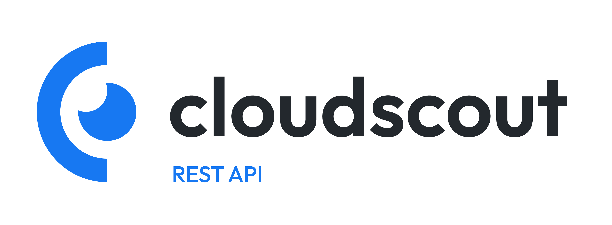

This is the RESTful API backend for my startup, cloudscout. This API was written in Flask and serves as the interface between the front-end application and the MongoDB database.

# Documentation

Coming soon...

